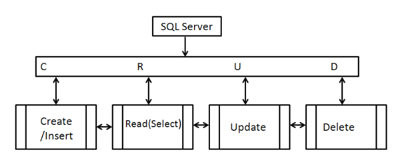

# Task Manager | CRUD functionality & connecting to external database 

This app covers an introduction to CRUD operations (Create, Read, Update & Delete) functionality and how to connect an app to an external Mongo database.

Prerequisite installations:

- MongoDB
- Python3
- PyMongo 

For this app, x1 data model was created:

- `app.py` - test the connection with MongoDB. Queries can be either added into this file or run from the mongo shell to test for a successful connection to the external databsse. 
    - Set environment variable
    - add database name

In addition, the following functions were created to execute CRUD operations;

    - `get_tasks` - default route decorator and directs user to main `tasks.html` file 
    - `add_task` - allows task categories in MongoDB to connect with `addtask.html` file 
    - `insert_task` - user submits task information to Mongo URI
    - `edit_task` - an id parameter is passed to locate a matched id, then object is wrapped for editing purposes 
    - `update_task` - user able to locate existing task with choice to either update or leave
    - `delete_task` - user to locate an existing task and choice set to delete or leave
    - `get_categories` - to do a find on the categories in MongoDB & render result in `categories.html` file
    - `add_category` - user is able to add a new task category
    - `edit_category` - an id parameter is passed to locate a matched id, then object is wrapped for editing purposes 
    - `update_category` - user able to locate existing category with choice to either update or leave
    - `delete_category` - user to locate an existing category and choice set to delete or leave
    - `insert_category` - user submits task information to Mongo URI

***

